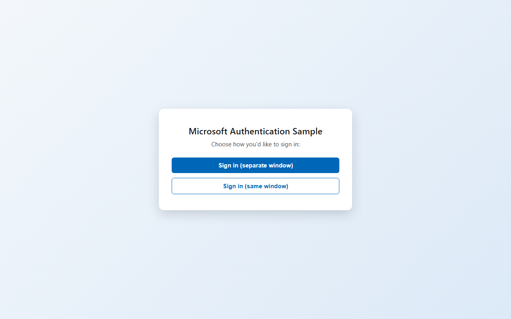

# Microsoft Authentication Sample React

[](https://ci.appveyor.com/project/Mahadenamuththa/microsoft-authentication-sample-react-vieep)
[](https://ci.appveyor.com/project/Mahadenamuththa/microsoft-authentication-sample-react/history)
[](https://pasinduumayanga.github.io/Microsoft_Authentication_Sample_React/)


[](https://github.com/PasinduUmayanga/Microsoft_Authentication_Sample_React/commits/main)

A minimal sample showing how to sign a user in with [Microsoft Entra ID](https://learn.microsoft.com/entra/) (Azure AD) from a React SPA using [`@azure/msal-browser`](https://www.npmjs.com/package/@azure/msal-browser) and [`@azure/msal-react`](https://www.npmjs.com/package/@azure/msal-react). It demonstrates the two interactive sign-in flows MSAL supports and lets the user pick either one.

Built with **React + TypeScript + [Vite](https://vite.dev/)** (migrated off Create React App) and tested with **[Vitest](https://vitest.dev/)** + **[Testing Library](https://testing-library.com/)**.

## Screenshot

Signed-out state, showing both sign-in options:



_(A screenshot of the signed-in state isn't included here because it requires a successful round trip through a real Microsoft Entra tenant, which this local build isn't configured against. Once signed in, the same card shows the account's name/username and a **Sign out** button instead of the two sign-in buttons — see [`UserProfile.tsx`](#userprofiletsx-post-sign-in-view).)_

## How authentication works

The app exposes both of MSAL's interactive sign-in flows as separate buttons instead of picking one for the user:

| Button | MSAL method | What happens |
|---|---|---|
| **Sign in (separate window)** | [`loginPopup`](https://learn.microsoft.com/entra/msal/javascript/browser/initialization#choosing-an-interaction-type) | Opens Microsoft's sign-in page in a **popup window**; the app's own window/tab is untouched and regains control once the popup closes. |
| **Sign in (same window)** | [`loginRedirect`](https://learn.microsoft.com/entra/msal/javascript/browser/initialization#choosing-an-interaction-type) | Navigates the **current window** to Microsoft's sign-in page, then back to the app (`redirectUri`) after the user authenticates. |

### `authConfig.ts` — a single MSAL instance

MSAL requires one shared `PublicClientApplication` for the whole app (creating a new one per click, as an earlier version of this sample did, is a bug). It's configured once from environment variables:

```ts
// src/auth/authConfig.ts
export const msalConfig: Configuration = {
  auth: {
    clientId: appOptions.ClientId ?? "",
    authority: `https://login.microsoftonline.com/${appOptions.TenantId}`,
    redirectUri: appOptions.RedirectUri,
  },
  cache: { cacheLocation: "sessionStorage" },
  // ...
};

export const loginRequest = { scopes: appOptions.Scopes };
export const msalInstance = new PublicClientApplication(msalConfig);
```

### `main.tsx` — startup sequence

MSAL must finish initializing — and, if the page just loaded after a `loginRedirect()` round trip, resolve that redirect response — **before** any component calls its APIs, so rendering is held until both promises settle:

```ts
// src/main.tsx
msalInstance
  .initialize()
  .then(() => msalInstance.handleRedirectPromise())
  .then(() => {
    root.render(
      <MsalProvider instance={msalInstance}>
        <App />
      </MsalProvider>
    );
  });
```

### `LoginButtons.tsx` — the two flows

```tsx
// src/view/pages/Login/LoginButtons.tsx
const { instance } = useMsal();

const signInWithPopup = () => instance.loginPopup(loginRequest);
const signInWithRedirect = () => instance.loginRedirect(loginRequest);
```

Each call is wrapped with loading/error state so a cancelled popup shows an inline message instead of a blocking `alert()`.

### `UserProfile.tsx` — post sign-in view

`Login.tsx` composes MSAL's `AuthenticatedTemplate` / `UnauthenticatedTemplate` to switch between the two buttons and the signed-in account view automatically, based on whether MSAL has an active account:

```tsx
<AuthenticatedTemplate>
  <UserProfile /> {/* account name/username + Sign out */}
</AuthenticatedTemplate>
<UnauthenticatedTemplate>
  <LoginButtons />
</UnauthenticatedTemplate>
```

## Project structure

```
src/
  auth/
    authConfig.ts        # msalConfig, loginRequest, the singleton PublicClientApplication
  common/
    commom.functions.ts  # GetAppOptions() - reads import.meta.env.VITE_*
    common.types.ts
    common.enum.ts
  view/pages/Login/
    Login.tsx            # switches between LoginButtons and UserProfile
    LoginButtons.tsx      # the two sign-in buttons
    UserProfile.tsx       # signed-in account + sign-out
    Login.css
  App.tsx
  main.tsx                # MsalProvider setup + app entry point
```

## Environment variables

Vite only exposes variables prefixed with `VITE_` to the client (see [`.env.development`](.env.development) / [`.env.test`](.env.test)):

| Variable | Purpose |
|---|---|
| `VITE_TENANT_ID` | Microsoft Entra tenant (directory) ID |
| `VITE_CLIENT_ID` | App registration's application (client) ID |
| `VITE_REDIRECT_URI` | Redirect URI registered for this app (must match the Entra app registration) |
| `VITE_SCOPES` | Comma-separated list of scopes requested at sign-in |
| `VITE_VERSION` / `VITE_ENV` | Informational, surfaced via `GetAppOptions()` |

## Available scripts

### `npm run dev`

Starts the Vite dev server at [http://localhost:5173](http://localhost:5173) with hot module reload.

### `npm test`

Runs the test suite once with [Vitest](https://vitest.dev/) (`npm run test:watch` for watch mode).

### `npm run build`

Type-checks (`tsc -b`) and builds an optimized production bundle into `dist/`.

### `npm run preview`

Serves the production build from `dist/` locally, to sanity-check it before deploying.

### `npm run lint`

Runs ESLint over the project.

### `npm run deploy`

Builds and publishes `dist/` to GitHub Pages via [`gh-pages`](https://www.npmjs.com/package/gh-pages).

## Testing

The suite covers every interactive piece of the auth flow, mocking `@azure/msal-react`'s `useMsal()`/templates so no real Microsoft Entra tenant is needed:

- `src/App.test.tsx` — both sign-in buttons render.
- `src/view/pages/Login/LoginButtons.test.tsx` — popup button calls `loginPopup` (not `loginRedirect`) and vice versa; a rejected popup shows an error message.
- `src/view/pages/Login/UserProfile.test.tsx` — renders nothing with no account, shows the account and calls `logoutPopup` on sign out.
- `src/view/pages/Login/Login.test.tsx` — switches between the sign-in buttons and the account view based on MSAL's `accounts`.
- `src/common/commom.functions.test.ts` — `GetAppOptions()` correctly maps `import.meta.env.VITE_*` variables, including scope-list parsing.

## Learn more

- [MSAL.js for React](https://learn.microsoft.com/entra/msal/javascript/react/)
- [Choosing an interaction type (popup vs. redirect)](https://learn.microsoft.com/entra/msal/javascript/browser/initialization#choosing-an-interaction-type)
- [Vite documentation](https://vite.dev/)
